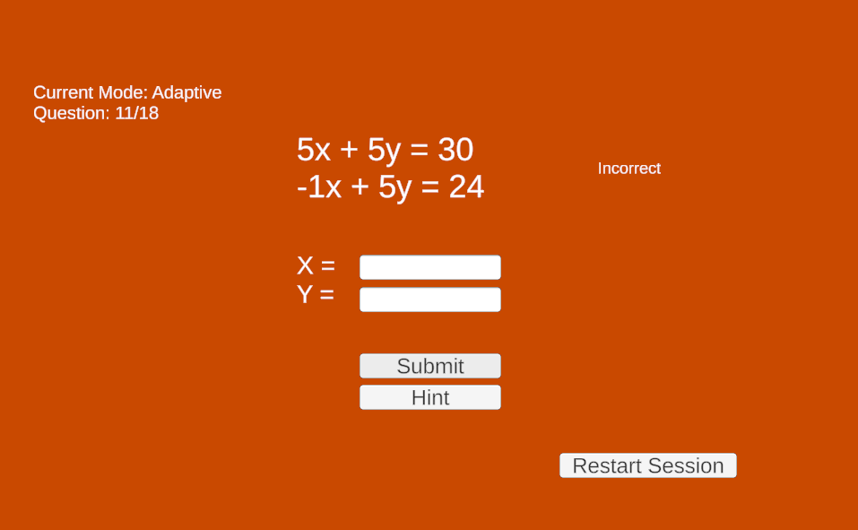
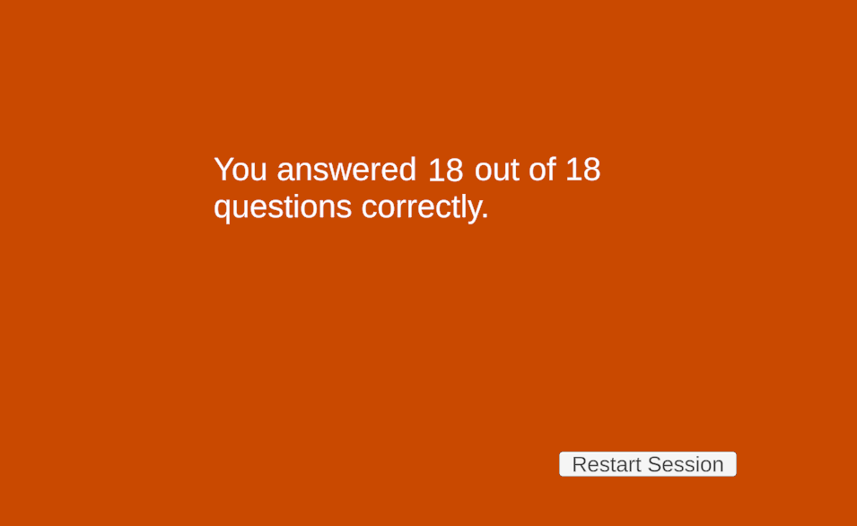

# Adaptive Math Tutor

A session-based adaptive tutoring system developed as part of my Master's capstone project. The system dynamically adjusts problem difficulty based on user performance within a single session.

---

## Overview

This project evaluates whether adaptive difficulty can improve learner performance without requiring persistent user profiles.

The system compares:
- A **baseline tutor** with fixed difficulty progression  
- An **adaptive tutor** that adjusts difficulty in real time  

Each session includes both modes to allow direct comparison.

---

## Key Features

- Dynamic difficulty adjustment using reinforcement learning–inspired logic  
- Session-based adaptation (no stored user profiles)  
- Per-question telemetry tracking  
- Performance metrics collection:
  - Accuracy  
  - Response time  
  - Hint usage  
  - Difficulty progression  

---

## Tech Stack

- **Frontend:** Unity (C#), WebGL  
- **Backend:** FastAPI (Python)  
- **Database:** SQLite  

---

## System Design

- 18 total problems per session:
  - 9 baseline (fixed sequence)  
  - 9 adaptive (dynamic difficulty)  

- Difficulty is tracked as a continuous value and mapped to:
  - Easy  
  - Medium  
  - Hard  

---

## Screenshots

---

## Notes

This repository represents my personal implementation of an academic capstone project, including system design, adaptive logic, and telemetry integration.
